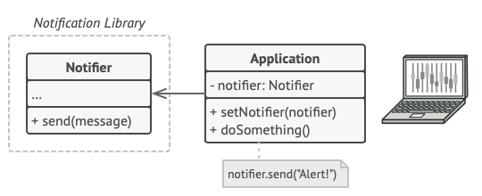
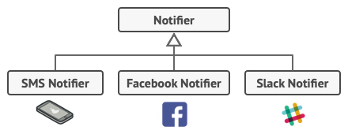
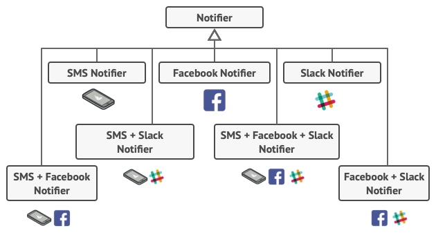

# Decorator
#### Also known as: Wrapper

* Decorator is a structural design pattern that lets you attach new behaviors to objects by placing these objects inside special wrapper objects that contain the behaviors.
* Decorator is a structural pattern that allows adding new behaviors to objects dynamically by placing them inside special wrapper objects, called decorators.

##### Using decorators you can wrap objects countless number of times since both target objects and decorators follow the same interface. The resulting object will get a stacking behavior of all wrappers.

----
## Problem:

Imagine that you’re working on a notification library which lets other programs notify their users about important events.

The initial version of the library was based on the Notifier class that had only a few fields, a constructor and a single send method. The method could accept a message argument from a client and send the message to a list of emails that were passed to the notifier via its constructor.

 

`A program could use the notifier class to send notifications about important events to a predefined set of emails.`

At some point, you realize that users of the library expect more than just email notifications. Many of them would like to receive an SMS about critical issues. Others would like to be notified on Facebook and, of course, the corporate users would love to get Slack notifications.

`Each notification type is implemented as a notifier’s subclass.`

How hard can that be? You extended the Notifier class and put the additional notification methods into new subclasses. Now the client was supposed to instantiate the desired notification class and use it for all further notifications.

But then someone reasonably asked you, “Why can’t you use several notification types at once? If your house is on fire, you’d probably want to be informed through every channel.”

You tried to address that problem by creating special subclasses which combined several notification methods within one class. However, it quickly became apparent that this approach would bloat the code immensely, not only the library code but the client code as well.

`Combinatorial explosion of subclasses.`

---
## Solution:

